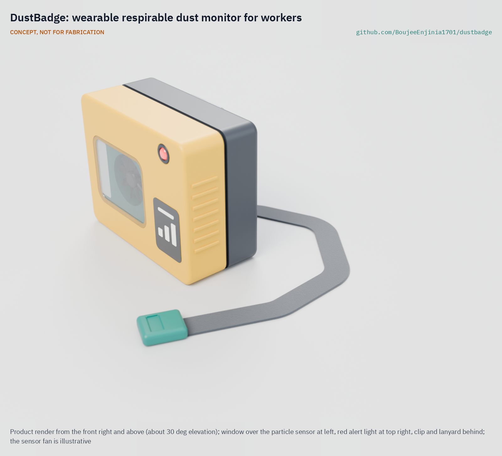
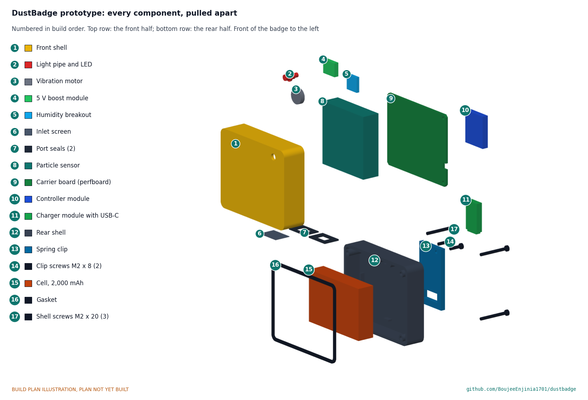

# DustBadge

     

**Area:** BioMedical · **TRL:** 3 of 9 (proof of concept on paper) · **Value-engineering target:** $91 USD · **Difficulty:** 3 of 5

A low-cost wearable dust monitor for workers in quarries, mines, stone fabrication and construction that estimates respirable dust exposure through the shift and warns before limits are reached.

[Exploded render](media/render-exploded.png) · [Worn render](media/render-worn.png) · [Interactive 3D model](media/viewer.html) · [Concept blueprint (PDF)](media/concept-blueprint.pdf) · [General arrangement (PDF)](cad/drawings/DBG-DWG-001.pdf) · [Calculations](docs/04-calcs/01-sizing.md) · [Prototype build plan](docs/05-build-plan.md) · [Review note](docs/REVIEW.md)

## Concept rationale

A worker can only change what they can see. Filter sampling tells a site, days later, what one worker breathed on one day; a badge that vibrates when the shift average is heading over the limit tells the worker during the task, while there is still time to wet the cut, move upwind, put on a respirator or stop. An optical particle sensor cannot identify silica, so DustBadge measures respirable dust, corrects it with a site filter sample, and shows silica only as a labeled estimate. The result is a screening tool, not a compliance instrument. It is a research and educational prototype, not a medical device.

It is open and garage-buildable because the workers most exposed, in informal quarries, small stone workshops and artisanal mines, are the least likely to be covered by an employer's sampling program or to afford commercial personal dust monitors. One sensor module, one Bluetooth board, a phone-charger-sized cell and a 3D-printed case keep the parts at about $91, and worker organizations, clinics and universities can build, audit and adapt it under CERN-OHL-S-2.0.

## Burning platform

Silicosis killed more than 12,900 people worldwide in 2019 ([Chen, Liu and Xie, BMC Pulmonary Medicine, 2022](https://link.springer.com/article/10.1186/s12890-022-02040-9)), and it cannot be cured, only prevented. In the United States about 2.3 million workers are exposed to respirable crystalline silica, and OSHA estimated its 50 µg/m³ limit would prevent more than 600 deaths a year once fully effective ([US Department of Labor, 2016](https://www.dol.gov/newsroom/releases/osha/osha20160324)).

The burden is heaviest where monitoring is thinnest. An estimated 44 million people work in artisanal and small-scale mining, and a 2023 systematic review found a pooled silicosis prevalence of 23.9 % among those studied, with disease appearing after fewer than 6 years of work ([Howlett et al., PLOS Global Public Health, 2023](https://journals.plos.org/globalpublichealth/article?id=10.1371%2Fjournal.pgph.0002085)). Engineered stone has brought the disease back among young benchtop fabricators in high-income countries too: California's electronic case reporting found stone fabrication workers with silicosis in 2022 and 2023, one of whom died and two of whom needed lung transplants ([CDC MMWR, 2023](https://www.cdc.gov/mmwr/volumes/72/wr/mm7246a4.htm)).

## Where it could be used

### By industry

| Industry | Use |
| --- | --- |
| Quarrying and aggregates | Drillers, crusher and screen operators, and loader drivers checking exposure by task and location |
| Surface metal and non-metal mining | In-shift screening between regulatory samples (not underground coal or explosive atmospheres) |
| Stone benchtop fabrication | Warning when dry cutting, grinding or polishing pushes exposure up |
| Construction | Feedback when cutting concrete, brick, block or tile, and during demolition |
| Artisanal and small-scale mining | Low-cost exposure awareness for crews with no sampling at all, through NGOs and health programs |
| Occupational health research and training | A cheap, open screening tool for surveys, worker education and hygiene courses |

### By country or region

| Country or region | Why it matters there |
| --- | --- |
| India | A scoping review of Indian studies found a pooled silicosis prevalence of about 26 %, with 52 % radiological evidence among Rajasthan mine workers studied ([scoping review, PMC](https://pmc.ncbi.nlm.nih.gov/articles/PMC11776177/)). |
| South Africa | Among 14,221 employed gold miners surveyed, 3.8 % had silicosis, almost all more than 15 years after first exposure ([BMC Public Health, 2020](https://link.springer.com/article/10.1186/s12889-020-08876-2)). |
| Artisanal mining regions of Africa, Latin America and Asia | About 44 million artisanal and small-scale miners, with average respirable silica exposures reported from 0.19 to 89.5 mg/m³ in studies ([Howlett et al., 2023](https://journals.plos.org/globalpublichealth/article?id=10.1371%2Fjournal.pgph.0002085)). |
| United States | About 2.3 million exposed workers ([US Department of Labor, 2016](https://www.dol.gov/newsroom/releases/osha/osha20160324)); MSHA's 2024 rule applies a 50 µg/m³ limit and 25 µg/m³ action level to miners ([MSHA](https://www.msha.gov/regulations/rulemaking/silica)). |
| European Union | About 5.5 million workers are regularly exposed, mostly in construction, under a binding limit of 0.1 mg/m³ ([EU-OSHA OSHwiki](https://oshwiki.osha.europa.eu/en/themes/respirable-crystalline-silica)). |
| Australia | Banned the use, supply and manufacture of engineered stone benchtops, panels and slabs from 1 July 2024 after silicosis rose among fabricators ([SafeWork NSW](https://www.safework.nsw.gov.au/news/safework-public-notice/engineered-stone-prohibition-to-commence-1-july-2024)); removal and repair of installed stone still exposes workers. |

## What sparked the idea

The starting point was an instrument that already proves in-shift feedback works, and the narrow group it serves. Under MSHA's 2014 respirable coal mine dust rule, US underground coal operators have had to use the continuous personal dust monitor since February 1, 2016 for the miners in the dustiest occupations; the rule describes it as a device that "measures continuously, and in real-time, the concentration of respirable coal mine dust" and reports results during and at the end of the shift ([Federal Register, 79 FR 24814, 2014](https://www.federalregister.gov/documents/2014/05/01/2014-09084/lowering-miners-exposure-to-respirable-coal-mine-dust-including-continuous-personal-dust-monitors)). Quarry workers, stone fabricators and artisanal miners exposed to silica have no equivalent. DustBadge asks how much of that in-shift feedback an open, low-cost badge can deliver for silica, as a labeled estimate rather than a compliance measurement.

## Problem

Respirable crystalline silica causes silicosis, which is incurable. Personal exposure sampling is expensive and results arrive days later, so most workers never know their exposure.

## Concept

A chest-worn badge samples respirable dust (PM4) every second with an optical particle sensor, corrects it with a site filter sample, estimates silica from the site's silica fraction, keeps a running 8 h average and vibrates when the projected shift average is heading over the action level. The log goes to the worker's phone over Bluetooth, and the worker decides who sees it.

Full design precis: [docs/02-concept.md](docs/02-concept.md)

## Key components

- Optical particle sensor with a PM4 output (Sensirion SPS30 class, proposed)
- nRF52840 Bluetooth Low Energy module with flash for the shift log
- Vibration motor and red alert LED
- 2,000 mAh protected LiPo cell: 17.7 h of continuous sampling at the sensor's typical current, 12.8 h at its maximum current and 0 °C (DBG-CAL-001)
- Humidity and temperature sensor to flag readings that humidity or spray may bias
- 3D-printed high-visibility case with a downward, screened inlet and a spring clip, worn within 30 cm of the nose and mouth
- Phone app (web Bluetooth page or app) for the shift log

TRL 3 calculations ([DBG-CAL-001](docs/04-calcs/01-sizing.md)), updated for the recommendations Amish accepted on 2026-09-25 ([DBG-DDR-002](docs/decisions/0002-recommendations-accepted.md)): 64 x 52 x 30 mm (33 mm with the clip), about 120 g, 17.7 h per charge typical and 12.8 h in the worst case, and an estimated $91 in parts, within the $91 value-engineering target Amish set on 2026-09-26. On paper the design is not intrinsically safe. The working range is accepted as the sensor's 1 mg/m³ with over-range minutes flagged; accuracy at low dust levels depends on a larger reference sample and a per-task site factor; and in hot sun the badge must be worn shaded above 40 °C. See the [design precis](docs/02-concept.md) and [requirements](docs/03-requirements.md).

The working bill of materials is in [bom/bom.csv](bom/bom.csv).

## Building the prototype

The [prototype build plan](docs/05-build-plan.md) (DBG-BLD-001) shows, in pictures, how to make each of the seventeen components and put them together in nine steps; nothing has been built yet. The made parts are two printed PETG shells, a printed TPU gasket and two port seals, a printed clear light pipe, a mesh inlet screen and a perfboard carrier; the sensor, cell, controller and small modules are bought and wired at block level. Writing the plan made the design buildable: the shells now close with three screws through a gasket, the sensor's ports are sealed to the floor slots, the sensor and cell are held by ribs, the clip is screwed on and the carrier board's modules have a place (DBG-DDR-003, open for Amish's review). Every picture is drawn from the model, and the model checks that each part touches what it should and clears what it should not.

## Safety

> A research and educational prototype, not a medical device and not certified monitoring or personal protective equipment. It does not replace regulatory sampling, dust controls or respirators, and a low reading does not mean the air is safe. It cannot measure silica directly; silica values are estimates.
>
> Not intrinsically safe: never use it in underground coal mines or anywhere flammable gas or combustible dust may be present.
>
> Lithium cells can overheat, vent and burn. Use a protected, fused cell, never charge the badge while it is worn, charge only between 0 and 45 °C, and never leave a first build charging unattended. In full sun above about 42 °C the badge can pass 60 °C; wear it shaded whenever the ambient is above 40 °C in full sun.

## Repository layout

| Folder | Contents |
| --- | --- |
| `docs/` | Problem, concept, requirements, calculations, prototype build plan, design decisions register and decision records |
| `cad/src/` | build123d Python source, the source of truth for all geometry |
| `cad/step/`, `cad/stl/` | Exported models for FreeCAD, other CAD tools and printing |
| `cad/drawings/` | 2D sketches and dimensioned drawings |
| `bom/` | Bill of materials |
| `electronics/` | KiCad schematics and PCB layouts |
| `firmware/` | Microcontroller code |
| `media/` | Renders, perspectives and photos |
| `build-log/` | Dated prototyping notes |

## Documentation

Controlled documents follow the portfolio [documentation standard](.kit/STANDARDS.md). Each carries a document ID (DBG-PRC-001 for the precis), a version and a revision history. Branded PDFs are built with `python .kit/render.py` and attached to GitHub Releases when a document is tagged, for example `DBG-PRC-001/v1.0`.

## Credits

Designed by Amish Chadha, with contributions from Dr. Geeti Chadha. See [CONTRIBUTORS.md](CONTRIBUTORS.md) for roles. To cite this design, use [CITATION.cff](CITATION.cff) (GitHub shows it as "Cite this repository").

AI assistance (Claude) was used to accelerate concept renders, prototype documentation and first-pass sizing calculations. Design direction and all decisions are Amish Chadha's, recorded in this repository's decision records (`docs/decisions/`).

## Licenses

- **Hardware** (CAD, drawings, BOM, electronics): [CERN-OHL-S v2](LICENSE)
- **Software** (firmware, scripts, notebooks): [MIT](LICENSE-SOFTWARE)

A project of the [Design Molecule](https://designmolecule.com) lab.
