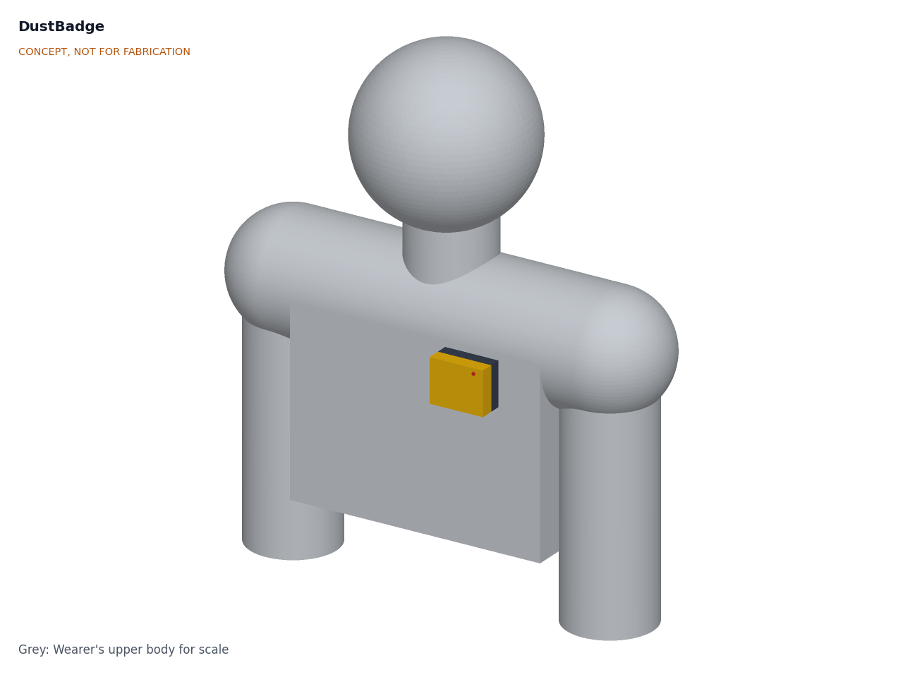
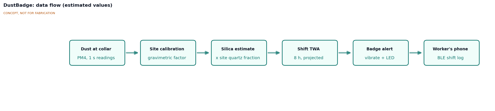
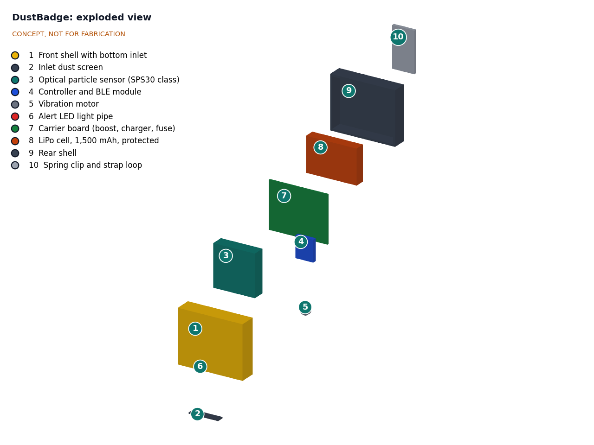
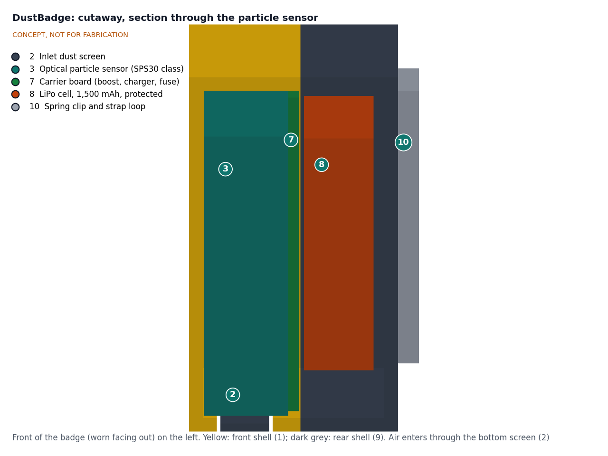

# DustBadge design precis

## Summary

DustBadge is a chest-worn badge, about 64 x 52 x 30 mm and 110 g, that samples respirable dust continuously with an optical particle sensor, converts it to an estimate of respirable crystalline silica using a site calibration, keeps a running 8 h time-weighted average, and vibrates when the projected shift average is heading over the action level. First-order numbers suggest one off-the-shelf sensor, a Bluetooth module and a 1,500 mAh cell can run a 12 h shift for about $85 in parts. It cannot identify silica or replace compliance sampling, and it does not meet the working range (R2) or hazardous-atmosphere (R14) requirements.

## How it works

1. **Sample.** A small fan in the particle sensor draws air in through a downward-facing screened inlet on the bottom of the badge. A laser counts and sizes particles, and the sensor reports mass concentration for particles up to 4 µm (PM4) every second.
2. **Calibrate.** A site factor, taken from at least one co-located filter sample, corrects the optical reading to a gravimetric respirable dust value. NIOSH notes that without such a factor, optical monitors can be off by up to 10 times ([Cauda, NIOSH, 2021](https://www.cdc.gov/niosh/nmam/pdf/chapter-am.pdf)). Chamber checks against a reference on the lab's CalRig calibration rig catch sensor drift between field samples.
3. **Estimate silica.** Calibrated respirable dust is multiplied by the site silica fraction (the quartz share of respirable dust for that site and task) to give an RCS estimate. With no fraction entered, the badge reports respirable dust only.
4. **Accumulate.** Every minute the firmware logs the 1 min average and updates the running TWA and a projection to the end of the shift at the current rate.
5. **Alert.** The badge vibrates and flashes when the projected 8 h RCS TWA passes the action level, and repeats at the limit. A short high peak (for example a dry cut) gives a separate brief alert so the worker can link the reading to the task.
6. **Sync.** At the end of the shift the worker's phone pulls the log over Bluetooth Low Energy (BLE). The worker decides whether to share it with a supervisor, hygienist or worker organization.

## Main components

Table 1. Main components, numbered to match the exploded view and bom/bom.csv.

| # | Component | Proposed choice | Notes |
| --- | --- | --- | --- |
| 1 | Front shell | 3D-printed PETG, high-visibility yellow, with bottom inlet slot | Proposed, awaiting Amish |
| 2 | Inlet dust screen | Stainless mesh, about 1 mm aperture | Keeps grit and splash out; must not act as a size selector for respirable particles |
| 3 | Particle sensor | Sensirion SPS30 class: PM1, PM2.5, PM4 and PM10 mass; 0 to 1,000 µg/m³; 41 x 41 x 12 mm; 26 g; 45 to 65 mA at 5 V ([datasheet](https://sensirion.com/media/documents/8600FF88/64A3B8D6/Sensirion_PM_Sensors_Datasheet_SPS30.pdf)) | Chosen for its PM4 output. Proposed, awaiting Amish |
| 4 | Controller and BLE | nRF52840 module with 2 MB flash and LiPo charger (Seeed XIAO nRF52840 class) | Same module family as TremorTrace |
| 5 | Vibration motor | 10 mm coin motor | Felt through clothing when noise makes a beep useless |
| 6 | Alert LED | Red LED with a light pipe through the front | Visible to the worker looking down and to coworkers |
| 7 | Carrier board | 5 V boost for the sensor, 500 mA charger, polyfuse, USB-C | Perfboard for the first build |
| 8 | Battery | 1,500 mAh 3.7 V protected LiPo, about 50 x 34 x 10 mm | See power budget |
| 9 | Rear shell | 3D-printed PETG with gasket | Holds the cell away from the body side |
| 10 | Clip | Stainless spring clip with strap loop | For a shirt pocket, collar, harness or hi-vis vest |

## First-order numbers

All values are estimates for concept review and will be checked at TRL 3.

Table 2. First-order estimates.

| Quantity | Estimate | Basis | Requirement |
| --- | --- | --- | --- |
| Sensor power | about 275 mW | 55 mA typical at 5 V | |
| Power drawn from the cell | about 335 mW | Sensor through an 85 % efficient boost (about 324 mW) plus controller and BLE about 11 mW | |
| Usable cell energy | about 4.4 Wh | 1,500 mAh x 3.7 V = 5.55 Wh, 80 % usable | |
| Run time, continuous sampling | about 13 h typical, about 11 h worst case | 4.4 Wh / 0.335 W; worst case at the 65 mA sensor maximum | R7 (12 h) at risk |
| Charge time | about 3.5 h | 1,500 mAh at 500 mA, with taper | |
| Respirable dust at the action level | about 250 µg/m³ | 25 µg/m³ RCS at an assumed 10 % silica fraction | Within the sensor's 1 mg/m³ range |
| Respirable dust at the action level, high-silica stone | about 30 to 50 µg/m³ | Silica fraction of 50 to 80 % (assumed for quartz-rich stone) | Sensor precision ±5 µg/m³ plus 5 % at this level |
| Upper end of useful range | about 1 mg/m³ | Sensor specification | R2 (5 mg/m³) not met |
| Log size | about 12 kB per shift | 16-byte record each minute, 12 h | R12 met; 30 shifts about 350 kB |
| Distance from badge to nose | about 220 mm | Massing model, chest mount | R8 met |
| Mass | about 110 g | Sensor 26 g, cell 30 g, shells 35 g, electronics 8 g, clip 6 g, motor, LED and screen 3 g | R9 met, thin margin |
| Size | 64 x 52 x 30 mm | Massing model | R9 met |
| Parts cost | about $85 | Indicative prices, see bom/bom.csv | R15 met |

## Key design choices

- **Estimate, never claim, silica.** The badge shows respirable dust as the measured quantity and RCS only as a labeled estimate from a site fraction. Proposed, awaiting Amish.
- **PM4 sensor rather than a cheaper PM2.5 sensor.** The SPS30 class reports the size band closest to the respirable convention. A Plantower PMS5003 costs less but reports only up to PM10 with no PM4 bin. Proposed, awaiting Amish.
- **Inlet facing down.** Reduces direct deposition of large chips and water spray into the sensor. Proposed, awaiting Amish.
- **Continuous sampling.** Cutting and grinding tasks can last a minute or two, so the fan runs all shift rather than duty cycling, at the cost of battery margin. Proposed, awaiting Amish.
- **Projected TWA alert.** Alerting on the projected shift average rather than on instantaneous readings avoids alarms every time a truck passes, while a separate brief peak alert still links dust to tasks.
- **Worker-owned data.** Logs stay on the badge and the worker's phone unless the worker shares them. Proposed, awaiting Amish.

## Dependencies on other lab projects

- **CalRig** provides the particle chamber and reference for periodic sensor checks. Field gravimetric samples are still needed for the site factor, because chamber dust is not site dust.
- The badge does not use FieldNode, which is a fixed outdoor node; a FieldNode with the same sensor could log area dust at a site as a later option.

## Safety

> **Safety:** DustBadge is a research and educational prototype. It is not certified monitoring equipment or personal protective equipment, and it does not replace regulatory exposure sampling, engineering controls or respirators. A low reading does not mean the air is safe: the sensor cannot see silica directly, can drift, and can under-read outside its calibration.
>
> **Safety:** It is not intrinsically safe. Do not use it in underground coal mines or in any place where flammable gas or combustible dust may be present.
>
> **Safety:** The lithium cell is worn against the body. Use a protected cell with a fuse, never charge while worn, do not charge above 45 °C or below 0 °C, and stop use if the badge becomes warm or swollen or has been crushed. Do not leave a first build charging unattended.
>
> **Safety:** Exposure logs are health-related personal data. Keep them with the worker, and never use them to discipline workers.

## Open questions for TRL 3

- Error budget: how close can a site-calibrated optical sensor get to a gravimetric shift average (R3), and how often must the site factor be refreshed?
- Range: can the SPS30 class be characterized above 1 mg/m³ on CalRig, or is a second sensor with a wider range needed (R2)?
- Humidity and water spray: how much do wet cutting and dust suppression sprays bias the readings, and can the firmware flag them (R11)?
- Inlet: does the screened downward inlet change sampling efficiency for respirable particles when the worker moves?
- Default limits and alert levels by jurisdiction. Proposed: US values by default, configurable, awaiting Amish.
- First co-design partner and first sector (quarries, stone fabrication or construction). Awaiting Amish.

Concept media: [blueprint sheet](../media/concept-blueprint.pdf), [interactive 3D model](../media/viewer.html).
