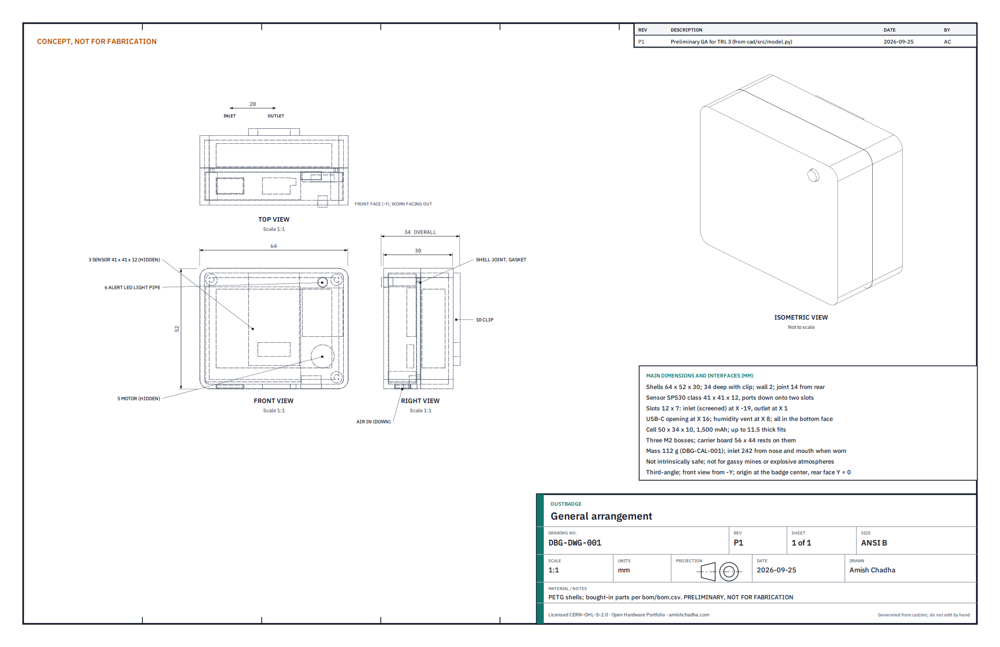

# DustBadge design precis

## Summary

DustBadge is a chest-worn badge, 64 x 52 x 30 mm (33 mm with the clip) and about 112 g, that samples respirable dust continuously with an optical particle sensor, converts it to an estimate of respirable crystalline silica using a site calibration, keeps a running 8 h time-weighted average, and vibrates when the projected shift average is heading over the action level. The TRL 3 calculations (DBG-CAL-001) show one off-the-shelf sensor, a Bluetooth module and a 1,500 mAh cell run a 12 h shift at the sensor's typical current (13.3 h) but not at its maximum current or at 0 °C (11.3 h), for $88 in parts against a $90 budget. It cannot identify silica or replace compliance sampling. On paper it misses the working range (R2), the ±25 % accuracy target at low dust levels (R3), operation in full sun at 45 °C (R11) and the hazardous-atmosphere requirement (R14).

## How it works

1. **Sample.** A small fan in the particle sensor draws air in through a downward-facing screened inlet on the bottom of the badge. A laser counts and sizes particles, and the sensor reports mass concentration for particles up to 4 µm (PM4) every second.
2. **Calibrate.** A site factor, taken from at least one co-located filter sample, corrects the optical reading to a gravimetric respirable dust value. NIOSH notes that without such a factor, optical monitors can be off by up to 10 times ([Cauda, NIOSH, 2021](https://www.cdc.gov/niosh/nmam/pdf/chapter-am.pdf)). Chamber checks against a reference on the lab's CalRig calibration rig catch sensor drift between field samples.
3. **Estimate silica.** Calibrated respirable dust is multiplied by the site silica fraction (the quartz share of respirable dust for that site and task) to give an RCS estimate. With no fraction entered, the badge reports respirable dust only.
4. **Accumulate.** Every minute the firmware logs the 1 min average and updates the running TWA and a projection to the end of the shift at the current rate.
5. **Alert.** The badge vibrates and flashes when the projected 8 h RCS TWA passes the action level, and repeats at the limit. A short high peak (for example a dry cut) gives a separate brief alert so the worker can link the reading to the task.
6. **Sync.** At the end of the shift the worker's phone pulls the log over Bluetooth Low Energy (BLE). The worker decides whether to share it with a supervisor, hygienist or worker organization.

## Main components

Table 1. Main components, numbered to match the exploded view and bom/bom.csv.

| # | Component | Proposed choice | Notes |
| --- | --- | --- | --- |
| 1 | Front shell | 3D-printed PETG, high-visibility yellow, with bottom inlet and outlet slots, USB-C opening and humidity vent; three M2 screw bosses | Adopted for TRL 3 (DBG-DDR-001, D7), pending Amish's review |
| 2 | Inlet dust screen | Stainless mesh, about 1 mm aperture | Keeps grit and splash out; must not act as a size selector for respirable particles |
| 3 | Particle sensor | Sensirion SPS30 class: PM1, PM2.5, PM4 and PM10 mass; 0 to 1,000 µg/m³; 41 x 41 x 12 mm; 26 g; 45 to 55 mA typical, 65 mA maximum at 5 V; PM4 precision ±25 µg/m³ below 100 µg/m³ and ±25 % above ([datasheet v2.0](https://sensirion.com/media/documents/8600FF88/64A3B8D6/Sensirion_PM_Sensors_Datasheet_SPS30.pdf)) | Chosen for its PM4 output. Adopted for TRL 3 (DBG-DDR-001, D1), pending Amish's review |
| 4 | Controller and BLE | nRF52840 module with 2 MB flash and LiPo charger (Seeed XIAO nRF52840 class) | Same module family as TremorTrace |
| 5 | Vibration motor | 10 mm coin motor | Felt through clothing when noise makes a beep useless |
| 6 | Alert LED | Red LED with a light pipe through the front | Visible to the worker looking down and to coworkers |
| 7 | Carrier board | 5 V boost for the sensor, 500 mA charger with a cell thermistor input, polyfuse, USB-C, SHT4x-class humidity and temperature sensor at a vent in the bottom face | Perfboard for the first build; humidity sensor and thermistor added at TRL 3 (DBG-CAL-001, sections B and C) |
| 8 | Battery | 1,500 mAh 3.7 V protected LiPo, about 50 x 34 x 10 mm, with thermistor | See power budget; a larger cell is proposed, awaiting Amish |
| 9 | Rear shell | 3D-printed PETG with gasket | Holds the cell away from the body side |
| 10 | Clip | Stainless spring clip with strap loop | For a shirt pocket, collar, harness or hi-vis vest |

## Numbers checked at TRL 3

All values come from DBG-CAL-001 and its script `docs/04-calcs/sizing.py`; the bracketed tags point to its output lines.

Table 2. Key numbers.

| Quantity | Value | Basis | Requirement |
| --- | --- | --- | --- |
| Power drawn from the cell | 335 mW typical, 393 mW maximum | Sensor 55 or 65 mA at 5 V through an 85 % boost, plus 11 mW for controller, BLE and humidity sensor [A3] | |
| Usable cell energy | 4.44 Wh; 3.77 Wh at 0 °C | 1,500 mAh x 3.7 V, 80 % usable, 85 % at 0 °C [A1] | |
| Run time, continuous sampling | 13.3 h typical; 11.3 h at maximum current or at 0 °C | [A3] | R7 at risk |
| Cell for 12 h in the worst case | about 1,880 mAh; up to 11.5 mm thick fits the shells | [A4, A6] | Proposed, awaiting Amish |
| Charge time | 3.4 h at 500 mA | [B1] | |
| Shell temperature in full sun | about 48 °C at 30 °C ambient, 63 °C at 45 °C ambient | Solar and electrical heat against surface losses [C1] | R11 not met above about 42 °C |
| Respirable dust at the action level | 250 µg/m³ at 10 % silica; 31 µg/m³ at 80 % silica | 25 µg/m³ RCS divided by the silica fraction [E2] | Within the 1 mg/m³ range |
| PM4 precision before site calibration | ±25 µg/m³ below 100 µg/m³ | Datasheet; 80 % of the dust level at the action level for quartz-rich stone [F4] | Site factor essential |
| Upper end of useful range | 1 mg/m³; limit in range for silica fractions of 5 % or more | Sensor specification [E1, E3] | R2 not met |
| Shift average uncertainty after site calibration | ±21 to ±29 % (quarry), ±34 to ±39 % (quartz-rich stone) | Root sum of squares, assumed terms [F2] | R3 not met on paper |
| Log size | 11.5 kB per 12 h shift; about 182 shifts in 2 MB | 16-byte record each minute [H1] | R12 met |
| Inlet to nose and mouth | 242 mm | Model, collar or upper-strap mount [I1] | R8 met |
| Mass | 111.8 g | Shells from model volume, parts from datasheets [J2] | R9 met, 8.2 g margin |
| Size | 64 x 52 x 30 mm; 33 mm deep with the clip | Model | R9 met |
| Parts cost | $88.00 | bom/bom.csv [L1] | R15 met, $2 margin |

## Key design choices

- **Estimate, never claim, silica.** The badge shows respirable dust as the measured quantity and RCS only as a labeled estimate from a site fraction. Adopted for TRL 3 (DBG-DDR-001, D2), pending Amish's review.
- **PM4 sensor rather than a cheaper PM2.5 sensor.** The SPS30 class reports the size band closest to the respirable convention. A Plantower PMS5003 costs less but reports only up to PM10 with no PM4 bin. Adopted for TRL 3 (DBG-DDR-001, D1), pending Amish's review.
- **Inlet facing down.** Reduces direct deposition of large chips and water spray into the sensor. Adopted for TRL 3 (DBG-DDR-001, D7), pending Amish's review.
- **Continuous sampling.** Cutting and grinding tasks can last a minute or two, so the fan runs all shift rather than duty cycling, at the cost of battery margin (R7 at risk). Adopted for TRL 3 (DBG-DDR-001, D4), pending Amish's review.
- **Projected TWA alert.** Alerting on the projected shift average (dose so far plus the last 60 min mean rate) rather than on instantaneous readings avoids alarms every time a truck passes, while a separate brief peak alert (1 min mean over 250 µg/m³ RCS) still links dust to tasks. DBG-CAL-001 section G checks five scenarios.
- **Over-range readings count, not vanish.** A minute above the sensor's 1 mg/m³ range is logged at the range limit, flagged and counted toward the projection, so the badge alerts rather than going quiet.
- **Humidity flag.** The added humidity sensor flags readings above 80 % RH, the sensor's best-performance limit, and sudden rises during wet cutting or spraying.
- **Worker-owned data.** Logs stay on the badge and the worker's phone unless the worker shares them, and are never used for discipline. Adopted for TRL 3 (DBG-DDR-001, D5), pending Amish's review.

## Dependencies on other lab projects

- **CalRig** provides the chamber for periodic badge-to-badge and drift checks. Its TRL 2 design uses incense smoke from 5 to 300 µg/m³ and states that results will not transfer directly to mineral dust, so it cannot characterize the sensor above 1 mg/m³ or set a site factor. Field gravimetric samples are still needed for the site factor, because chamber aerosol is not site dust. The badge (64 x 52 x 33 mm) fits CalRig's 400 x 300 x 300 mm chamber.
- The badge does not use FieldNode, which is a fixed outdoor node; a FieldNode with the same sensor could log area dust at a site as a later option.

## Safety

> **Safety:** DustBadge is a research and educational prototype. It is not certified monitoring equipment or personal protective equipment, and it does not replace regulatory exposure sampling, engineering controls or respirators. A low reading does not mean the air is safe: the sensor cannot see silica directly, can drift, and can under-read outside its calibration.
>
> **Safety:** It is not intrinsically safe. Do not use it in underground coal mines or in any place where flammable gas or combustible dust may be present.
>
> **Safety:** The lithium cell is worn against the body. Use a protected cell with a fuse, never charge while worn, do not charge above 45 °C or below 0 °C, and stop use if the badge becomes warm or swollen or has been crushed. In full sun above about 42 °C ambient the shell can pass 60 °C (DBG-CAL-001, section C), above the cell's and the sensor's limits; wear it in shade or under a vest flap in such heat. Do not leave a first build charging unattended.
>
> **Safety:** Exposure logs are health-related personal data. Keep them with the worker, and never use them to discipline workers.

## Open questions

- Accuracy (R3): the error terms in DBG-CAL-001 section F are assumed. A larger reference sample, a relaxed target or both are proposed in `docs/REVIEW.md`, awaiting Amish.
- Range (R2): the sensor's response above 1 mg/m³ to mineral dust is unknown and cannot be checked on CalRig as designed.
- Humidity and water spray (R11): the size of the bias from wet cutting and dust suppression sprays is unknown; the badge can now flag high humidity.
- Sun (R11): a lighter shell or a vented hood would lower the shell temperature. Proposed, awaiting Amish.
- Cell (R7): a 1,900 to 2,000 mAh cell up to 11.5 mm thick. Proposed, awaiting Amish.
- Inlet: does the screened downward inlet change sampling efficiency for respirable particles when the worker moves?
- First co-design partner (DBG-DDR-001, O1) and how a site silica fraction is obtained (O2). Proposed, awaiting Amish.

Concept media: [blueprint sheet](../media/concept-blueprint.pdf), [interactive 3D model](../media/viewer.html). General arrangement: [DBG-DWG-001](../cad/drawings/DBG-DWG-001.pdf). Model: `cad/src/model.py`, exports in `cad/step/` and `cad/stl/`.
