# DustBadge prototype build plan

**Plan, not yet built.** How to build the first proof-of-concept prototype, component by component. Building and testing to it is TRL 4 work. Decisions still to be made are kept in the design decisions register ([docs/06-design-decisions.md](06-design-decisions.md)), not here.

## 1. What you are building

*Figure 1. Every component pulled apart and numbered in build order: the front half above, the rear half below.*

The prototype is one DustBadge: a hi-vis yellow printed front shell and a dark printed rear shell, 64 x 52 x 30 mm, closed by three small screws from the back, with a spring clip on the back for a collar, pocket or harness strap. Inside, a bought particle sensor sits on two soft seals over two slots in the bottom face, so its fan draws air up through a mesh screen; behind it a perfboard carries the controller and a charger, and behind that a 2,000 mAh lithium polymer cell sits in the rear shell. A coin motor, a 5 V boost module and a humidity sensor are taped to the inside of the front face, and a red LED shines through a light pipe. Figure 1 shows the 17 components in the order you make or fit them. Six are printed (the two shells, the gasket, two port seals and the light pipe), the screen is cut from mesh, the perfboard is cut and drilled and the bought clip may need two holes; everything else is bought and wired. The work is 3D printing in PETG and TPU, cutting and drilling perfboard, small soldering, and fitting with screws and tape. The parts cost about $91 from the bill of materials.

> **Safety:** The badge holds a 2,000 mAh lithium polymer cell and is worn against the body. Keep the cell out of the badge until the stop points of section 6 say otherwise, never charge it while worn, below 0 °C or above 45 °C, and never leave a first build charging unattended. The badge is not intrinsically safe: do not take it into a gassy mine or any place with flammable gas or combustible dust. Its readings are a research estimate, not a safety measurement. Soldering and printing give off fumes; work in a ventilated space.

## 2. What changed to make it buildable

The concept showed what the badge does; some of its parts could not be made, fixed or sealed as drawn. Each change below keeps what the badge does and its size, and all of them are recorded in decision record DBG-DDR-003, open for Amish's review.

*Table 1. Changes from the concept.*

| Component | The concept had | The buildable design has | Why |
| --- | --- | --- | --- |
| Shell closure | Bosses in the front shell only, with a 14 mm gap behind the board and no screws | Three tubes in the rear shell and three M2 x 20 screws from the rear face that clamp the rear shell, gasket and board onto the front bosses (Figure 15) | The badge closes, and the board is held, with one set of screws |
| Gasket | Listed, but no room for it | A flat printed TPU frame 1 mm thick between the rims; the rear shell is 1 mm shallower (Figure 18) | Seals the joint; the badge stays 30 mm deep |
| Sensor air path | Sensor ports 1 mm above the slots, open to the inside | Two printed TPU seals between the ports and the slots (Figure 7) | The fan draws only outside air |
| Inlet screen | A 1.2 mm screen sitting loose in the slot | A 16 x 11 mm mesh square on the inner floor, held by the inlet seal (Figure 7) | Held and sealed without glue in the air path |
| Sensor and cell | Nothing holding the sensor up or the cell sideways | Two stop ribs over the sensor; four ribs round the cell (Figures 11 and 14) | Each has a load path for a drop |
| Electronics | Boost, charger and humidity sensor not placed; the humidity vent opened under the sensor | Charger with USB-C on the board; boost, humidity sensor and motor taped inside the front face; USB-C opening and vent moved (Figures 3 and 12) | The only free space is beside the sensor; the vent now opens under the humidity sensor |
| Carrier board | 56 x 44 mm, screw holes breaking its edges | 59 x 47 mm with cut corners and a notch for the cell lead (Figure 9) | Material round every hole |
| Clip | No fixing | Two M2 x 8 screws into bosses above the cell (Figure 17) | The only place above the cell clear of the shell screws |
| Light pipe | A loose rod with no LED behind it | A printed clear pipe with an inside flange and a pocket for the LED (Figure 5) | Held in, and lit where it needs to be |

## 3. Making the components

Make and check each component before the assembly step that needs it. Sizes are in millimetres. "Left" and "right" are as seen looking at the front of the badge (the yellow face, worn facing out); "up" is toward the top edge as worn. Print tolerance is 0.2 mm unless a step says otherwise; drawings do not carry tolerances before TRL 4.

### 3.1 Front shell

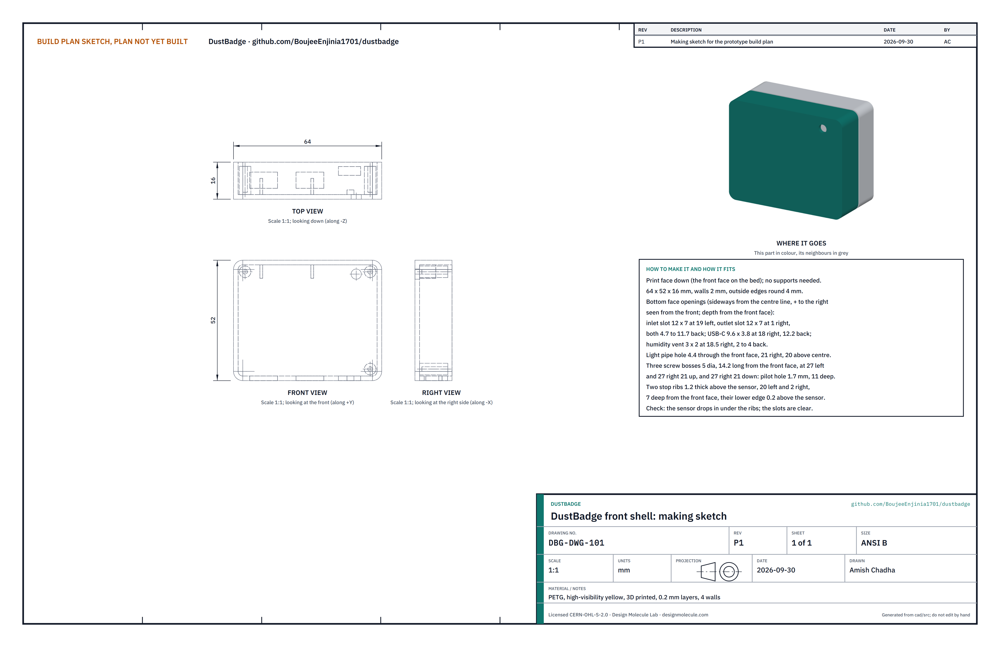

*Figure 2. Front shell making sketch (DBG-DWG-101).*

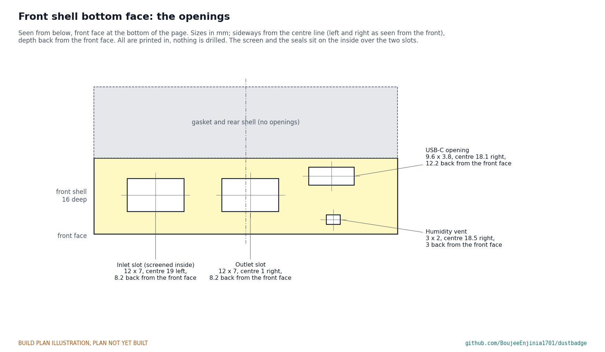

*Figure 3. The four openings in the bottom face, seen from below, front face at the bottom of the page.*

**What it is and what it is made from.** The yellow front half of the badge, 64 x 52 x 16 mm, open at the back, with the inlet and outlet slots, the USB-C opening and the humidity vent in its bottom face, a hole for the light pipe in its front face, three screw bosses and two stop ribs inside. PETG, high-visibility yellow, printed at 0.2 mm layers with four walls.

**How to make it.**

1. Print it face down (the front face on the bed). No supports are needed: the openings in the bottom face bridge 12 mm at most.
2. Check the four bottom openings against Figure 3 and the 4.4 mm light-pipe hole, 21 right and 20 up from the centre of the front face. Clear any stringing with a craft knife.
3. Open the three bosses (27 left and 27 right, 21 up; 27 right, 21 down, seen from the front) to 1.7 mm, 11 deep, with a hand drill, so the thread-forming screws start straight.
4. Check the two stop ribs above the sensor's place: 1.2 thick, 20 left and 2 right of centre, their lower edges 42.2 mm above the inner floor.

**How it fits the parts next to it.** The light pipe goes through its hole from inside (Figure 5). The screen and the two seals sit on the inner floor over the slots, and the sensor rests on the seals under the ribs (Figure 7). The board rests on the ends of the three bosses, with the charger module's USB-C sitting in its opening 0.8 mm inside the bottom face. The gasket sits on the rim (Figure 18).

**Check before moving on.** The sensor, set in by hand without the seals, drops under the ribs with about 1.2 mm to spare; a USB-C plug enters its opening square.

### 3.2 Light pipe and LED

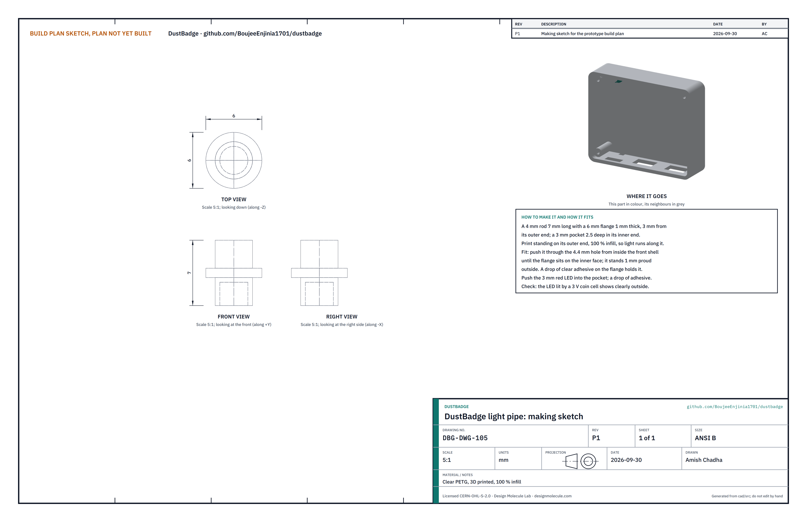

*Figure 4. Light pipe making sketch (DBG-DWG-105).*

**What it is and what it is made from.** A short clear rod that carries the alert LED's light through the front face. Clear PETG, printed at 100 % infill; a bought red 3 mm LED.

**How to make it.**

1. Print the pipe standing on its outer end: a 4 mm rod 7 mm long, with a 6 mm flange 1 mm thick 3 mm from the outer end, and a 3 mm pocket 2.5 deep in the inner end.
2. Solder 60 mm leads to the LED and sleeve them; mark the positive lead.
3. Push the LED into the pocket with a drop of clear adhesive.

**How it fits the parts next to it.**

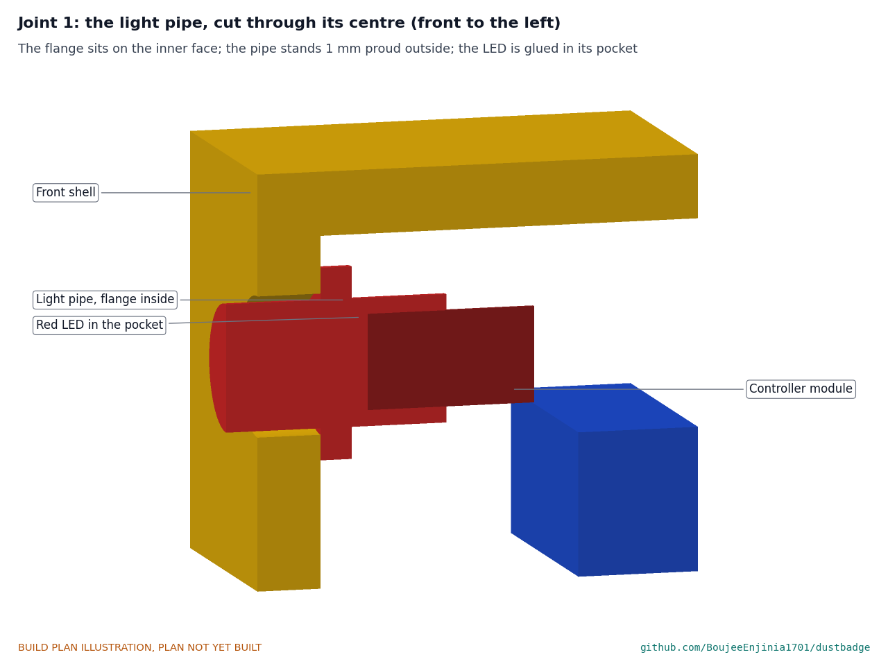

*Figure 5. The flange sits on the inside of the front face; the pipe stands 1 mm proud outside; the LED is in the pocket.*

The pipe goes through the 4.4 mm hole from inside until the flange sits flat on the inner face; a drop of clear adhesive on the flange holds it. The LED leads go back to the board past the controller module, 1.7 mm clear of it.

**Check before moving on.** Lit from a 3 V coin cell through a 100 Ω resistor, the light shows clearly from outside.

### 3.3 Inlet screen

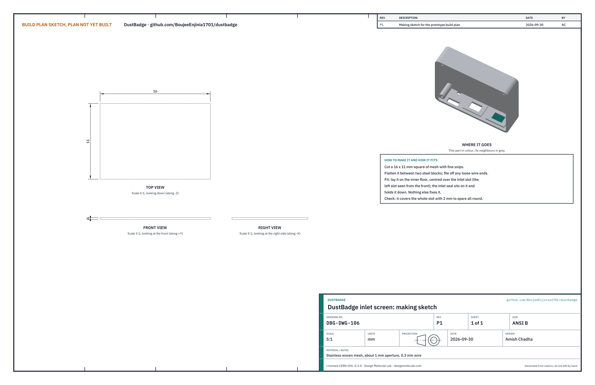

*Figure 6. Inlet screen making sketch (DBG-DWG-106). The 0.3 mm thickness is shown rounded on the drawing.*

**What it is and what it is made from.** A square of mesh over the inlet slot that keeps grit and splash out of the sensor. Stainless woven mesh with about 1 mm openings and 0.3 mm wire; it must not act as a size filter for respirable particles, so do not use a finer mesh.

**How to make it.**

1. Cut a 16 x 11 mm square with fine snips.
2. Flatten it between two steel blocks and file off any loose wire ends.

**How it fits the parts next to it.**

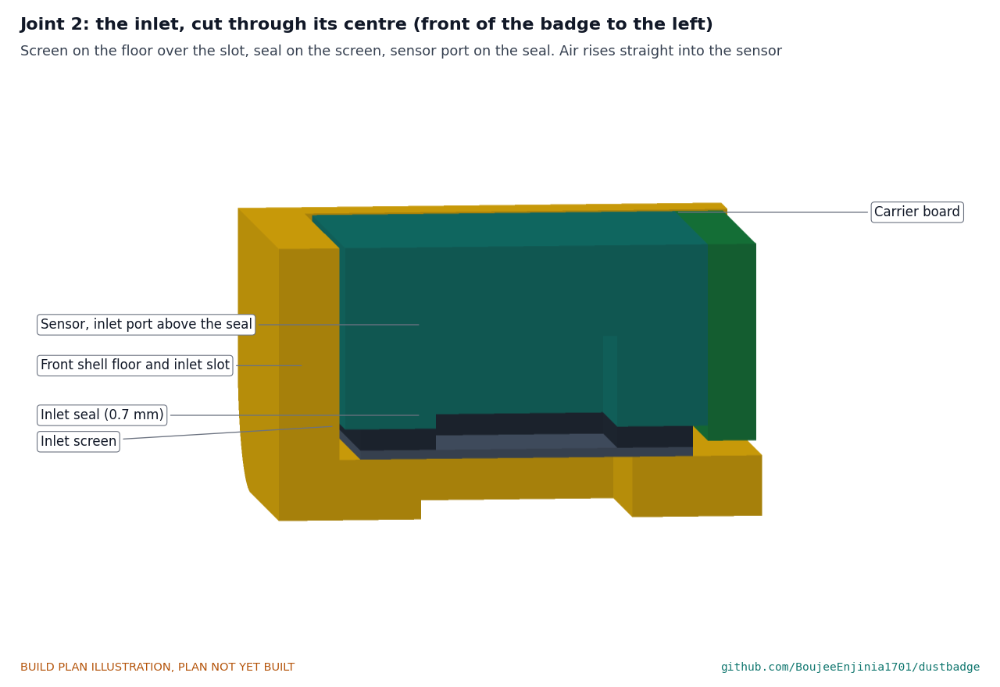

*Figure 7. Screen on the floor over the inlet slot, the thin seal on the screen, the sensor's inlet port on the seal.*

The screen lies on the inner floor centred over the inlet slot (the left-hand slot, 19 left of centre and 8.2 back from the front face), covering it with 2 mm to spare all round. The inlet seal sits on it and holds it down; nothing else fixes it.

**Check before moving on.** The screen lies flat with no wire ends standing up.

### 3.4 Port seals (make 2)

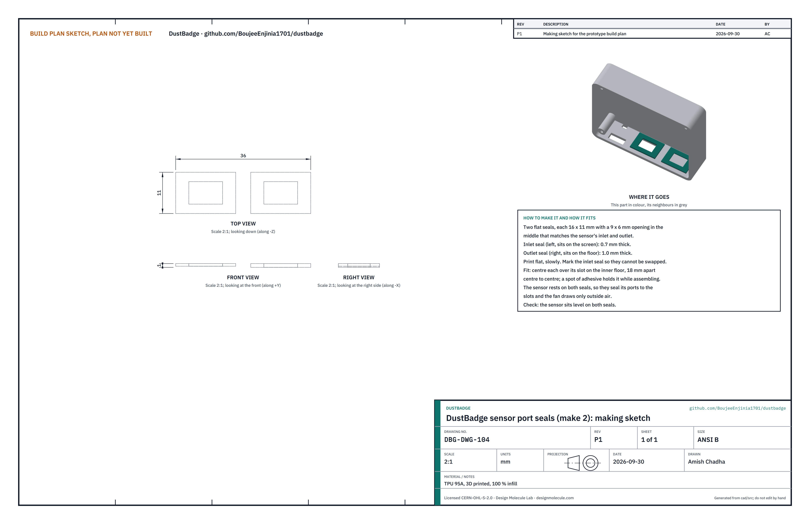

*Figure 8. Port seal making sketch (DBG-DWG-104).*

**What they are and what they are made from.** Two flat seals that join the sensor's inlet and outlet ports to the slots in the floor, so the fan draws only outside air. TPU 95A, printed at 100 % infill.

**How to make them.**

1. Print both flat and slowly: each 16 x 11 mm with a 9 x 6 mm opening in the middle. The inlet seal is 0.7 mm thick; the outlet seal is 1.0 mm.
2. Mark the inlet seal with a dot so the two cannot be swapped.

**How they fit the parts next to them.** The inlet seal sits on the screen; the outlet seal sits on the floor over the outlet slot (1 right of centre), 18 mm centre to centre from the inlet seal (Figure 7). A small spot of adhesive at one corner of each, away from the opening, holds them while you assemble. The sensor rests on both, so the different thicknesses keep it level.

**Check before moving on.** With the sensor set on them, it sits level and does not rock.

### 3.5 Carrier board, with the controller and charger

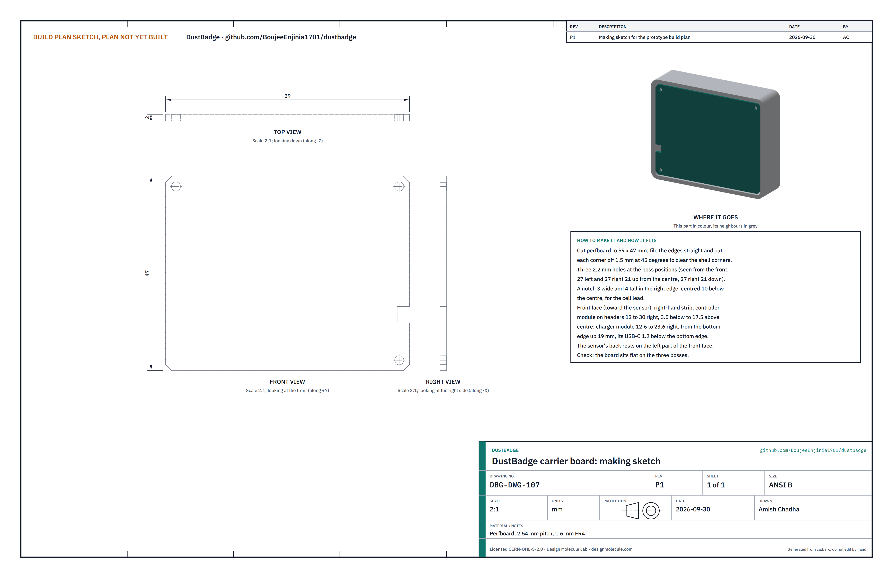

*Figure 9. Carrier board making sketch (DBG-DWG-107).*

**What it is and what it is made from.** The board behind the sensor that carries the controller module and the charger module, holds the sensor against the front shell, and is clamped by the three shell screws. Perfboard, 2.54 mm pitch, 1.6 mm thick.

**How to make it.**

1. Cut the perfboard to 59 x 47 mm and file the edges straight. Cut each corner off 1.5 mm at 45°.
2. Drill three 2.2 mm holes, seen from the front: 27 left and 21 up, 27 right and 21 up, 27 right and 21 down from the centre of the board.
3. Cut a notch 3 wide and 4 tall in the right edge, centred 10 below the centre, for the cell lead.
4. On the front face (the face toward the sensor), fit the controller module on header pins in the right-hand strip, from 12 to 30 right and from 3.5 below to 17.5 above the centre.
5. Below it, fit the charger module with its USB-C receptacle on its lower edge, from 12.6 to 23.6 right, its board starting at the board's lower edge and its USB-C standing 1.2 below that edge. Solder both.
6. Fit the polyfuse and the small transistor, diode and resistors for the motor and LED in the free holes on the right-hand strip.
7. Wire the board as Figure 12 shows (section 3.5.1).

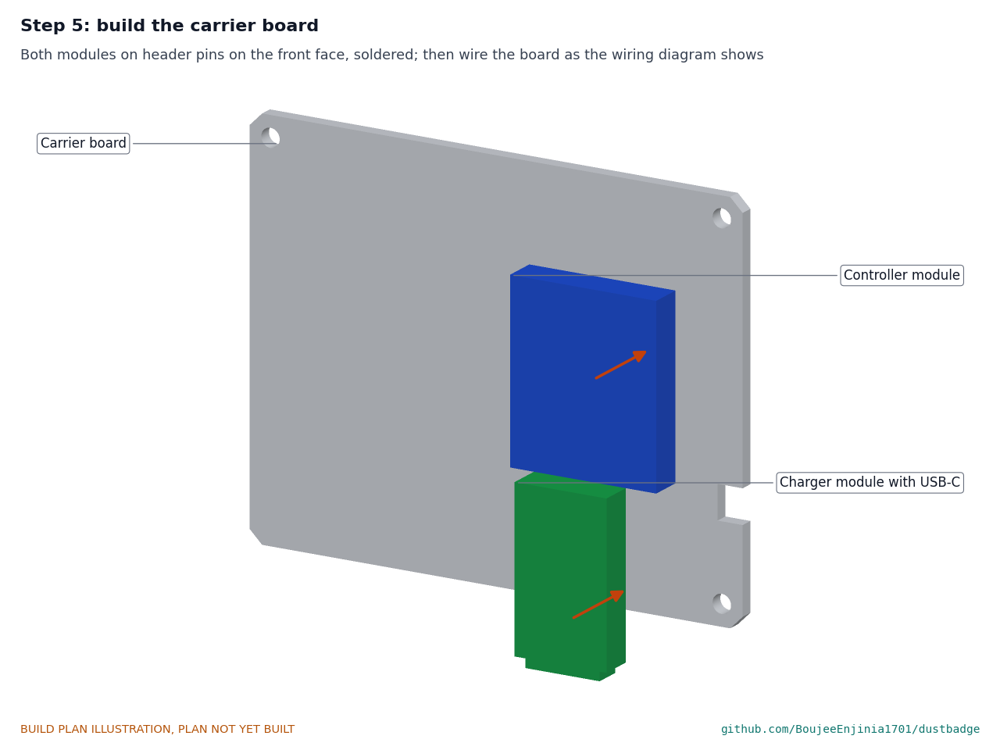

*Figure 10. Where the two modules go on the front of the board.*

**How it fits the parts next to it.**

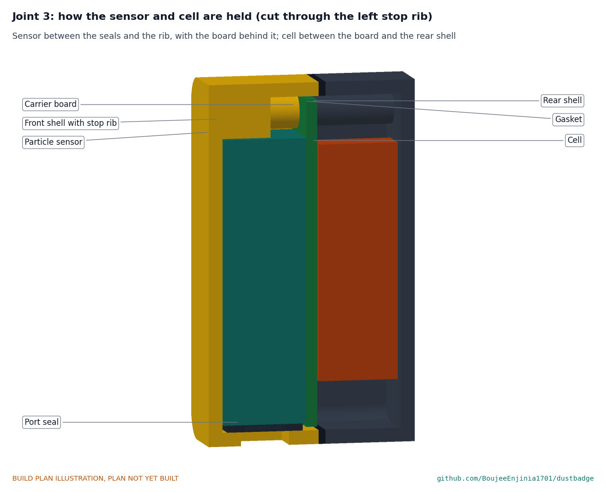

*Figure 11. Cut through the left stop rib: the sensor between the seals, the rib and the board; the cell between the board and the rear shell.*

The board rests on the ends of the three front bosses. The sensor's back rests on the left part of the board's front face. The three rear tubes press on the board's back, so the shell screws clamp it (Figure 15). The cell sits 0.2 mm behind the board.

**Check before moving on.** The board sits flat on the three bosses in a trial fit, with the USB-C square in its opening.

#### 3.5.1 Wiring

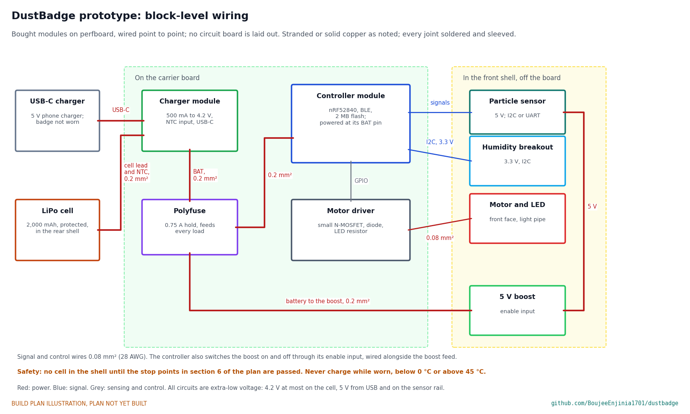

*Figure 12. Block-level wiring with wire sizes. No circuit board is laid out at this stage; bought modules stand in for one.*

The modules are bought to this specification:

*Table 2. Modules and what to buy.*

| Module | What to buy |
| --- | --- |
| Controller | nRF52840 module with Bluetooth Low Energy and 2 MB flash, about 17.5 x 21 mm (Seeed XIAO nRF52840 class) |
| Charger | Single-cell lithium polymer charger, 4.2 V, 500 mA, with a cell temperature (NTC) input that stops charging below 0 °C and above 45 °C, and a USB-C receptacle on its short edge; no larger than 11 x 19 mm |
| 5 V boost | Boost converter from the cell to 5 V, at least 100 mA, with an enable input; no larger than 11.4 x 9 mm |
| Humidity sensor | SHT4x-class humidity and temperature breakout, I2C, 3.3 V, with the sensor at one edge; no larger than 10 x 10 mm |
| Polyfuse | Resettable fuse, about 0.75 A hold, on the cell side of every load |
| Motor driver | Small logic-level N-channel transistor, a diode across the motor, and a resistor for the LED |

Wire it like this, soldering every joint and sleeving it with heat shrink:

1. Cell lead (with its NTC wire) to the charger's battery and NTC terminals: 0.2 mm² (24 AWG), through the notch in the board's right edge.
2. Charger battery output through the polyfuse to the controller's battery pin: 0.2 mm².
3. Polyfuse to the 5 V boost on the front face: 0.2 mm², about 60 mm long, so the board can be laid aside while you work.
4. Boost 5 V output to the sensor's supply pins: 0.2 mm².
5. Sensor signals to the controller: 0.08 mm² (28 AWG), using the sensor's own cable.
6. Humidity breakout to the controller's I2C pins and 3.3 V: 0.08 mm².
7. Controller output to the boost's enable input, and to the motor driver: 0.08 mm².
8. Motor driver to the motor and to the LED: 0.08 mm², about 60 mm long.

Check that the charger's temperature window really is 0 to 45 °C in its datasheet before buying: some chargers of this class fix a different window.

**Check before moving on.** Every wire continues end to end; with no cell connected, the battery terminals read open to ground; every wire is labelled.

### 3.6 Rear shell

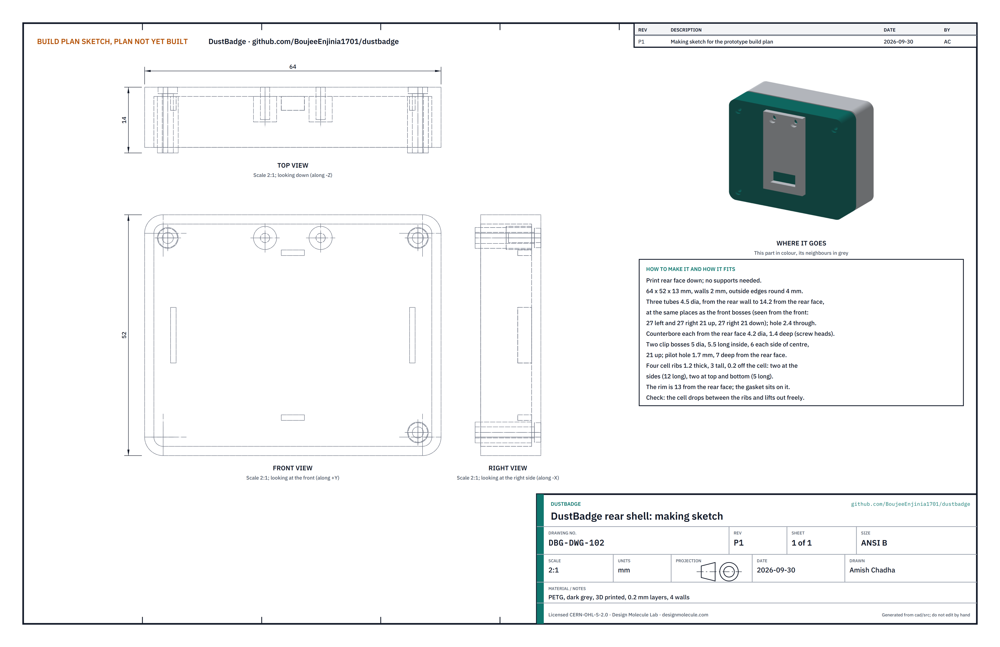

*Figure 13. Rear shell making sketch (DBG-DWG-102), front view looking into its open side.*

**What it is and what it is made from.** The dark back half of the badge, against the wearer, 64 x 52 x 13 mm, with three tubes for the shell screws, two bosses for the clip screws and four ribs that locate the cell. PETG, dark grey, printed at 0.2 mm layers with four walls.

**How to make it.**

1. Print it rear face down. No supports are needed.
2. Check the three tubes: 4.5 across with a 2.4 mm hole through, reaching 14.2 from the rear face, each counterbored 4.2 across and 1.4 deep from the rear face for a screw head.
3. Open the two clip bosses (6 each side of centre, 21 up) to 1.7 mm, 7 deep from the rear face.
4. Check the four cell ribs: 1.2 thick and 3 tall, 0.2 from the cell all round.

**How it fits the parts next to it.**

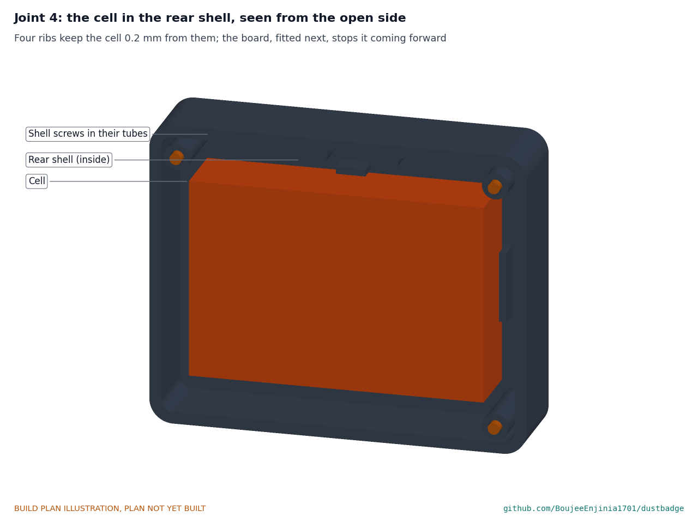

*Figure 14. The cell between its four ribs, seen from the open side, with the shell screws in their tubes.*

The cell sits between the ribs, 0.5 mm off the inside of the rear wall. The tubes press on the back of the board. The rim, 13 from the rear face, sits on the gasket.

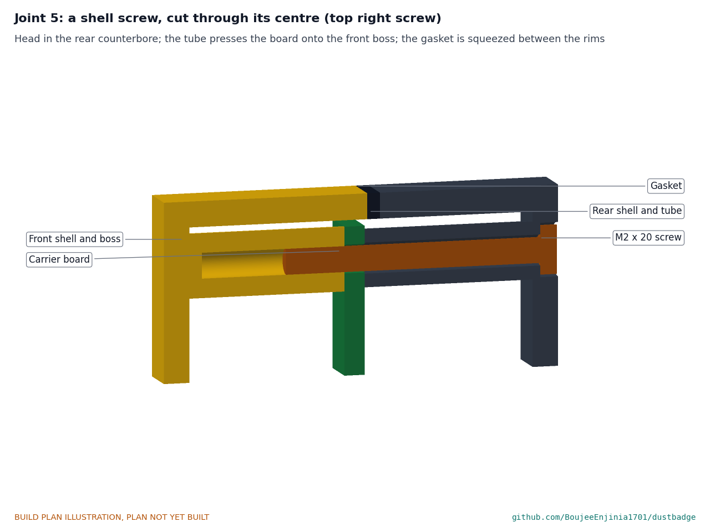

*Figure 15. A shell screw, cut through its centre: head in the counterbore, the tube pressing the board onto the front boss, the gasket squeezed between the rims.*

**Check before moving on.** The cell drops between the ribs and lifts out without force.

### 3.7 Spring clip, drilled

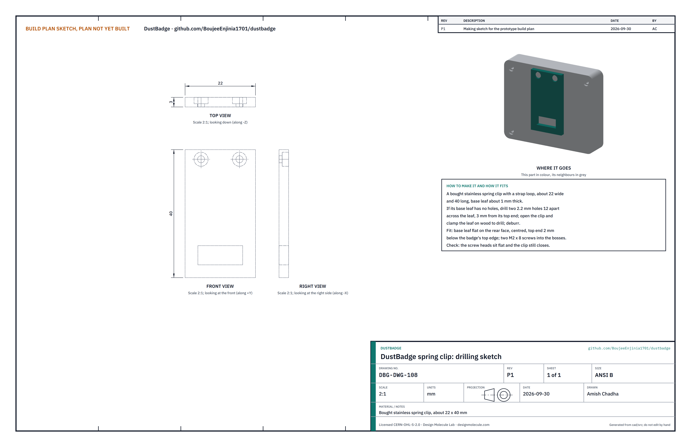

*Figure 16. Spring clip drilling sketch (DBG-DWG-108).*

**What it is and what it is made from.** A bought stainless spring clip with a strap loop, about 22 wide and 40 long, that holds the badge on a collar, pocket, harness strap or hi-vis vest.

**How to make it.**

1. If its base leaf has no holes, open the clip, clamp the base leaf on a piece of wood and drill two 2.2 mm holes across it, 12 apart and 3 mm from its top end.
2. Deburr both sides.

**How it fits the parts next to it.**

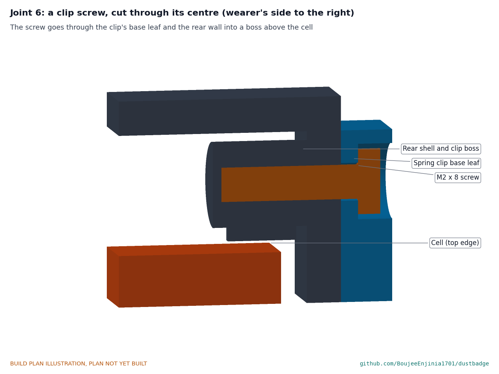

*Figure 17. A clip screw, cut through its centre: through the base leaf and the rear wall into a boss above the cell.*

The base leaf lies flat on the rear face, centred, its top end 2 mm below the badge's top edge. Two M2 x 8 thread-forming screws go through it into the two bosses, 3 mm clear of the cell.

**Check before moving on.** The screw heads sit flat and the clip still closes fully.

### 3.8 Gasket

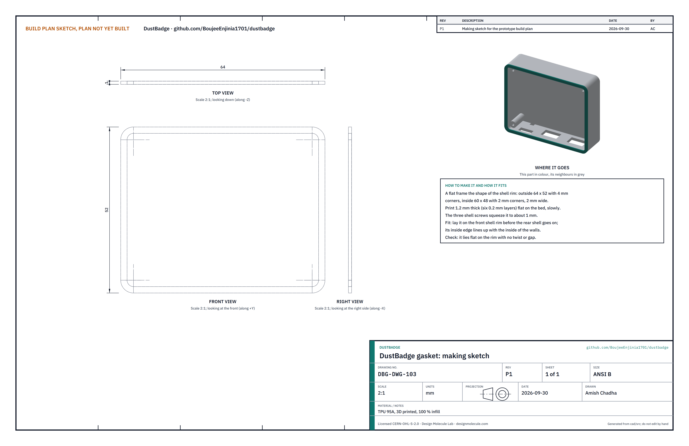

*Figure 18. Gasket making sketch (DBG-DWG-103), shown in place on the front shell's rim.*

**What it is and what it is made from.** A flat frame that seals the joint between the two shells. TPU 95A, printed at 100 % infill.

**How to make it.** Print it flat and slowly, 1.2 mm thick (six 0.2 mm layers): 64 x 52 outside with 4 mm corners, 60 x 48 inside with 2 mm corners, 2 mm wide.

**How it fits the parts next to it.** It lies on the front shell's rim, its inside edge in line with the inside of the walls. The rear shell's rim sits on it, and the three shell screws squeeze it to about 1 mm (Figure 15).

**Check before moving on.** It lies flat on the rim with no twist or gap.

### 3.9 Bought components

Buy to specification, not brand. Line numbers are those of the bill of materials.

- **Particle sensor (line 3).** Sensirion SPS30 class: PM1, PM2.5, PM4 and PM10 mass, 0 to 1,000 µg/m³, 41 x 41 x 12 mm, 5 V, with its inlet and outlet on one narrow edge and its interface cable.
- **Controller (line 4) and carrier board modules (line 7).** As Table 2.
- **Vibration motor (line 5).** 10 mm coin motor, 3 V, about 3 mm thick, with an adhesive back and leads.
- **LED (line 6).** Red 3 mm LED.
- **Cell (line 8).** 2,000 mAh 3.7 V protected lithium polymer cell, no larger than 50 x 34 x 11.5 mm including its protection board, with a 10 kΩ NTC lead, from a maker that publishes a datasheet.
- **Clip (line 10).** As section 3.7.
- **Fixings and consumables (line 11).** Three M2 x 20 and two M2 x 8 thread-forming pan-head screws for plastics; thin double-sided foam tape; 0.2 mm² and 0.08 mm² wire; heat shrink; clear adhesive.

## 4. Putting it together

In each picture the parts already fitted are grey and the part being fitted is in colour, with an arrow showing the way it goes in. Steps 1 to 6 are done with the front shell lying face down on a soft cloth, looking into its open back.

### Step 1: light pipe and LED into the front shell

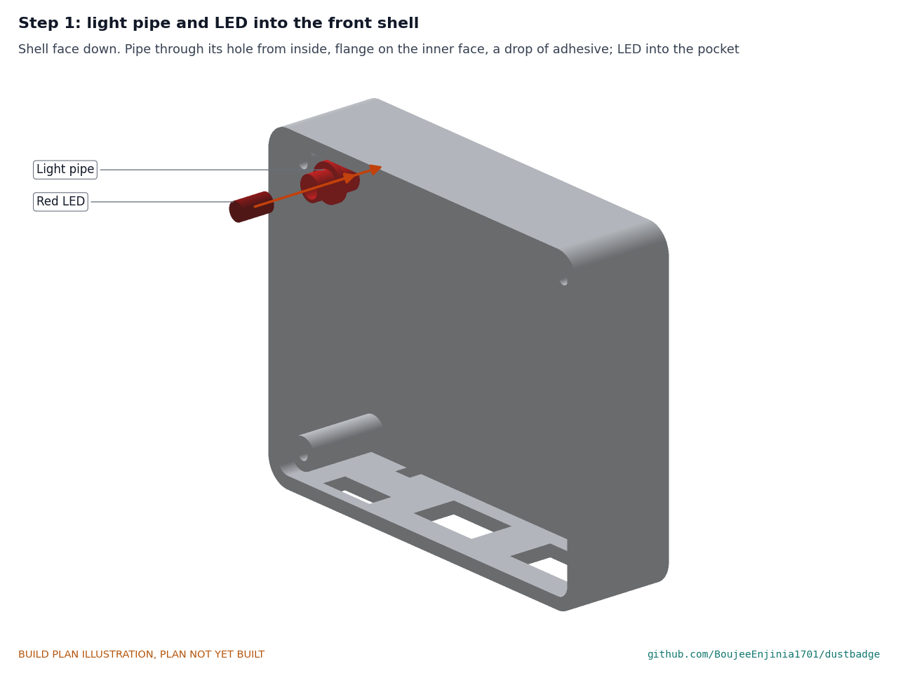

The pipe goes through its hole from inside, flange down on the inner face, with a drop of clear adhesive; then the LED goes into its pocket.

### Step 2: motor, boost module and humidity breakout onto the front face

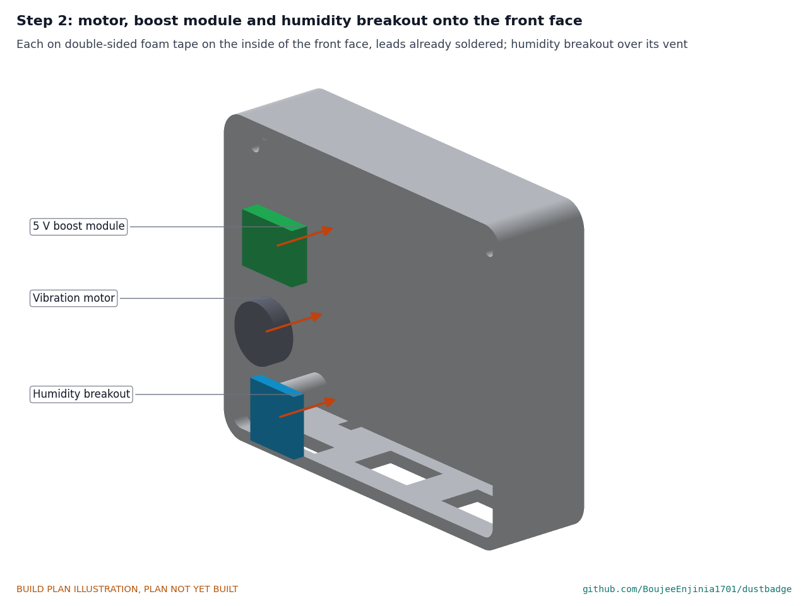

Each goes on a piece of thin double-sided foam tape on the inside of the front face, in the strip right of the sensor's place, with its leads already soldered: the boost module highest, the motor in the middle, the humidity breakout at the bottom, sitting on the floor over its vent.

### Step 3: screen and port seals onto the inner floor

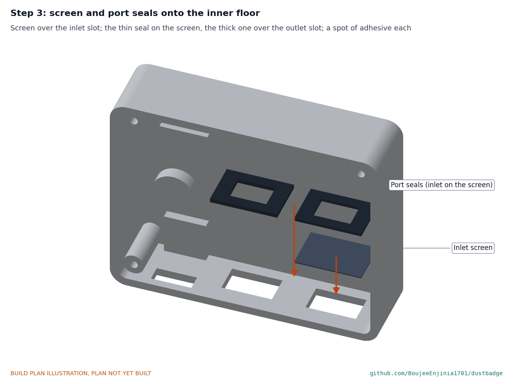

The screen over the inlet slot; the thin, marked seal on the screen; the thick seal over the outlet slot. A spot of adhesive at one corner of each seal.

### Step 4: particle sensor into its pocket

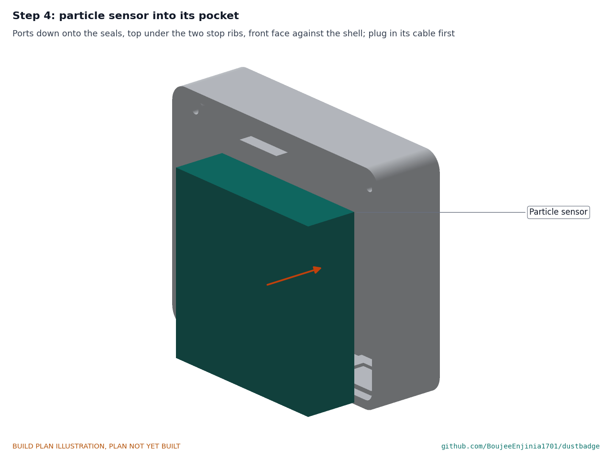

Plug in its cable first. Lower the sensor with its ports down onto the seals, its top under the two stop ribs and its front face against the shell. It should sit level and not rock.

### Step 5: build the carrier board

As section 3.5. **Hold point:** the wiring checks of section 3.5.1 pass before going on.

### Step 6: carrier board onto the front bosses

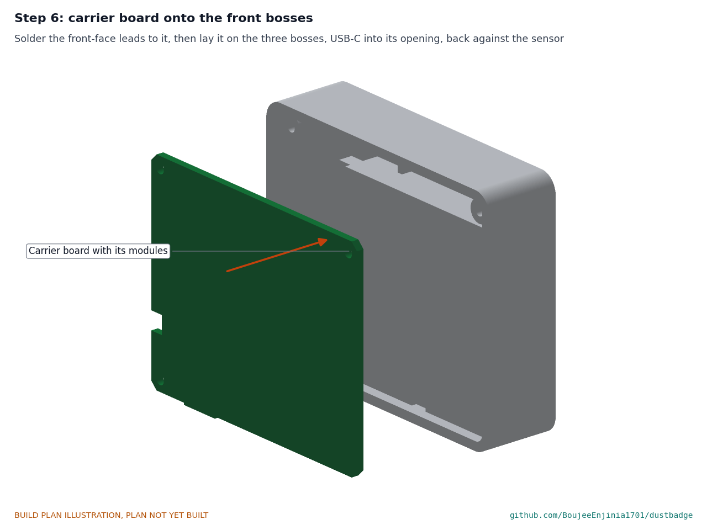

Solder the leads from the front-face parts and the LED to the board and plug in the sensor cable. Lay the board on the three bosses, front face toward the sensor, with the USB-C in its opening. **Hold point:** no wire lies across a boss, the rim or the sensor's seals.

### Step 7: spring clip onto the rear shell

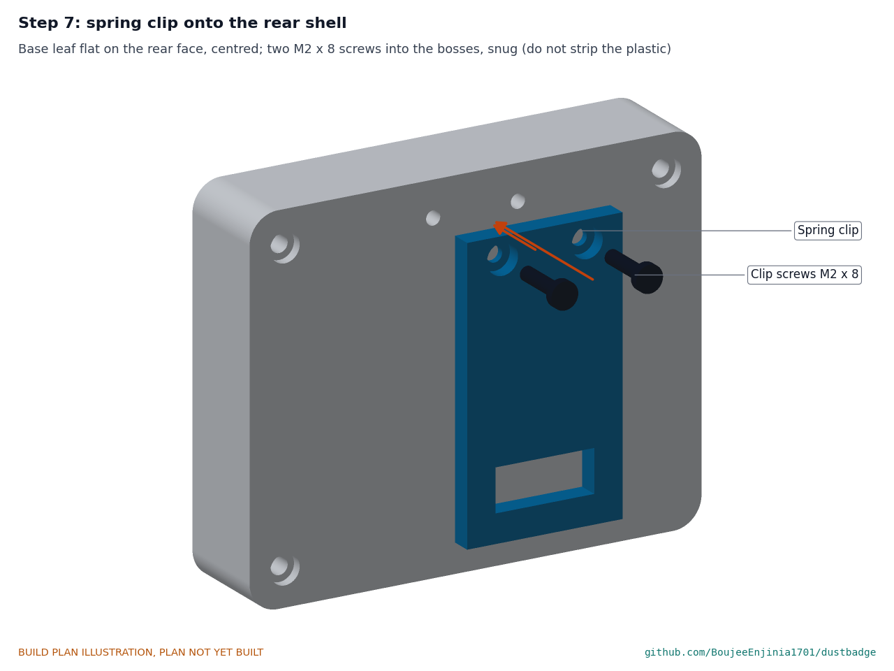

Base leaf flat on the rear face, centred; two M2 x 8 screws into the bosses, snug. Thread-forming screws strip PETG if overtightened: stop when the head seats.

### Step 8: cell into the rear shell

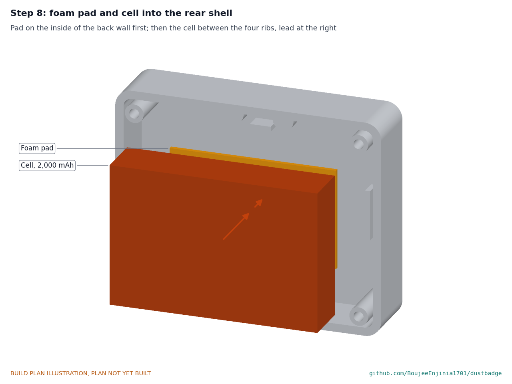

**Hold point:** safety stops S1 to S4 in section 6. Lay the cell between the four ribs with its lead at the right, pass the lead through the notch in the board and plug it into the charger module.

### Step 9: close the badge

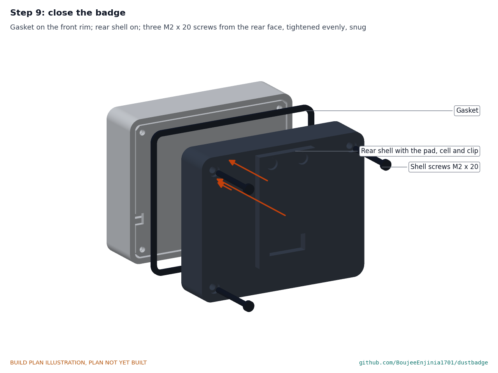

Lay the gasket on the front rim. Fit the rear shell, checking that no wire is caught on the rim or between the cell and the board. Fit the three M2 x 20 screws from the rear face and tighten them in turn, a little at a time, until the gasket is evenly squeezed and the joint is closed all round. **Hold point:** safety stop S5.

## 5. First checks

These are the checks a TRL 4 test report would record; this plan only lists them. Requirement numbers are those of DBG-REQ-001.

*Table 3. First checks.*

| Check | Requirement | How | Pass when |
| --- | --- | --- | --- |
| Charge voltage and current | R7 | USB power meter between a phone charger and the badge; cell connected, badge on the bench | Charging ends at 4.2 V, give or take 0.05 V; current 500 mA or less |
| Cold and hot charge stop | R11 | Replace the cell's NTC with a resistor equal to its value at -1 °C, then at 46 °C | No charge current in either case (under 10 mA) |
| Air path | R1 | Badge closed; hold a smoke source 50 mm below the inlet, then cover the inlet slot with tape | The reading rises with smoke and falls to near zero with the inlet covered |
| Alert | R6 | Trigger the alert from the firmware sketch | The motor is felt through a shirt and the LED is seen from 2 m |
| Log over Bluetooth | R12 | Run 1 h, then pull the log to a phone | 60 one-minute records arrive |
| Humidity reading | R11 | Breathe gently at the bottom face | The humidity reading rises within 30 s |
| Shell joint | R10 | Feeler gauge round the joint after closing | No gap over 0.2 mm anywhere |
| Run time | R7 | Full charge, continuous sampling at room temperature | 12 h or more |
| Mass and size | R9 | Weigh on a 0.1 g scale; measure with calipers | 120 g or less (119.9 g estimated); 64 x 52 x 33 mm with the clip |
| Worn position | R8 | Clip to a collar or harness strap | The inlet faces down and is within 300 mm of the nose and mouth |

## 6. Safety stops

Stop at each point. Carry on only when everything listed is true.

- **S1. Before the cell comes into the workshop.** The cell is a protected cell from a maker that publishes a datasheet, at 3.6 to 4.0 V, with no swelling, dents or leaks. A charging spot is ready on a non-combustible surface (a ceramic tile or steel tray), away from anything that burns.
- **S2. Before the cell is plugged in.** The polarity of the cell's plug matches the charger module's socket, checked with a meter, not by wire colour: small connectors of this kind are made both ways round. With no cell, the charger's battery terminals and every supply read open to ground.
- **S3. Before any charging.** Both charge-stop checks of section 5 pass with the substitute resistors. The cell's NTC is then reconnected and lies against the cell.
- **S4. First charge.** Attended the whole time, with the badge open on the charging spot, the cell checked by hand every 15 minutes. Stop if the cell becomes warm to the touch, swells or smells, or if the charger reads above 4.25 V. Never bypass the charge stop.
- **S5. Before the badge is closed.** No wire is pinched under the board or across the gasket; the cell lead runs through the notch; the cell lies flat between its ribs.
- **S6. Before the badge is worn.** It is worn only for bench and indoor trials until a TRL 4 test plan says otherwise; never while charging; never in a gassy mine or any place with flammable gas or combustible dust; shaded when the ambient is above 40 °C in full sun. Its reading is a research estimate: it never replaces a respirator, engineering controls or regulatory sampling.
- **S7. At every charge.** Look at the cell through the open badge from time to time: retire it at the first sign of swelling, damage or heat.

## 7. Tools, skills and workspace

**Tools.** 3D printer with a bed of at least 70 x 60 mm that prints PETG and TPU 95A (a direct-drive extruder helps with TPU); craft knife; fine snips; hand drill or pin vice with 1.7, 2.2 and 2.4 mm drills; small files; calipers; steel rule; soldering iron with a fine tip, solder and flux; wire strippers; heat gun for heat shrink; multimeter; USB-C power meter; small cross-head screwdriver; feeler gauges; scale reading to 0.1 g; two resistors to stand in for the NTC (values from the cell's datasheet).

**Skills.** No certified trade is needed. Basic 3D printing in PETG and TPU, fine soldering of modules and wires, and care with lithium cells. All circuits are extra-low voltage: 4.2 V at most on the cell, 5 V from USB and on the sensor supply. The USB charger must be a certified, undamaged unit; no mains wiring is part of this build.

**Workspace.** A bench about 1.0 x 0.6 m with an anti-static mat; a ventilated place for printing and soldering; the charging spot of S1.

**Personal protective equipment.** Safety glasses for soldering, cutting mesh and drilling; a fume extractor or open window when soldering.

## 8. Where the numbers come from

- Model and constructability checks: `cad/src/model.py` (`python cad/src/model.py --check`, 43 checks); STEP and STL exports in `cad/step/` and `cad/stl/`.
- Pictures: `cad/src/build_plan_media.py`, using `.kit/build_views.py`; written to `docs/05-build-plan/` and `cad/drawings/DBG-DWG-101` to `DBG-DWG-108`.
- General arrangement: `cad/drawings/DBG-DWG-001.pdf`, Rev P4.
- Calculations: `docs/04-calcs/01-sizing.md` (DBG-CAL-001 v0.5) and `docs/04-calcs/sizing.py`; mass [J1], [J2]; drop retention [K1]; run time [A3]; cost [L1].
- Bill of materials: `bom/bom.csv`.
- Decisions: `docs/decisions/0003-design-for-construction.md` (DBG-DDR-003), with DBG-DDR-001 and DBG-DDR-002.
- Requirements: `docs/03-requirements.md` (DBG-REQ-001 v0.7).
